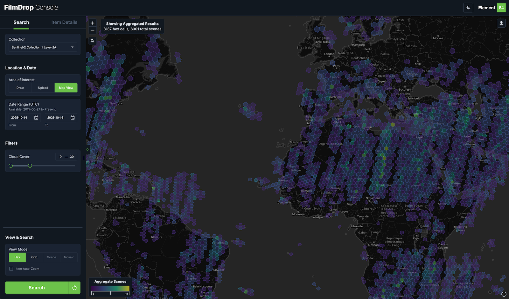
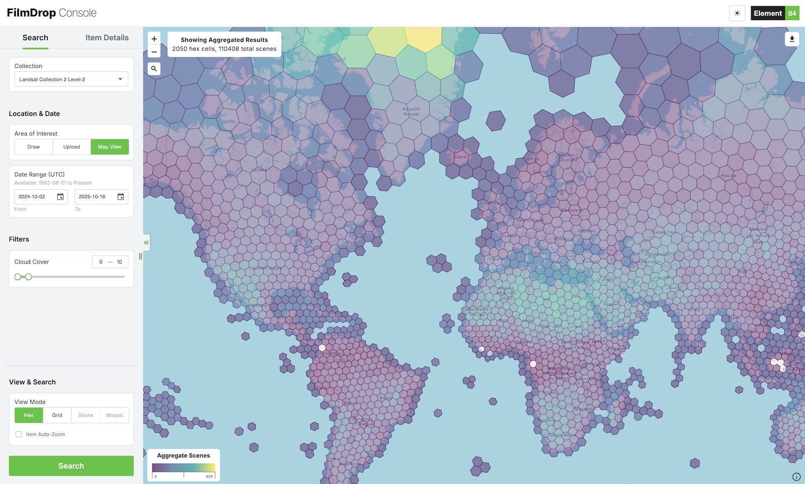
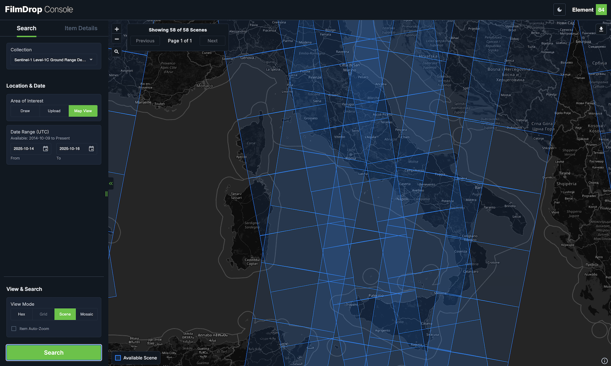
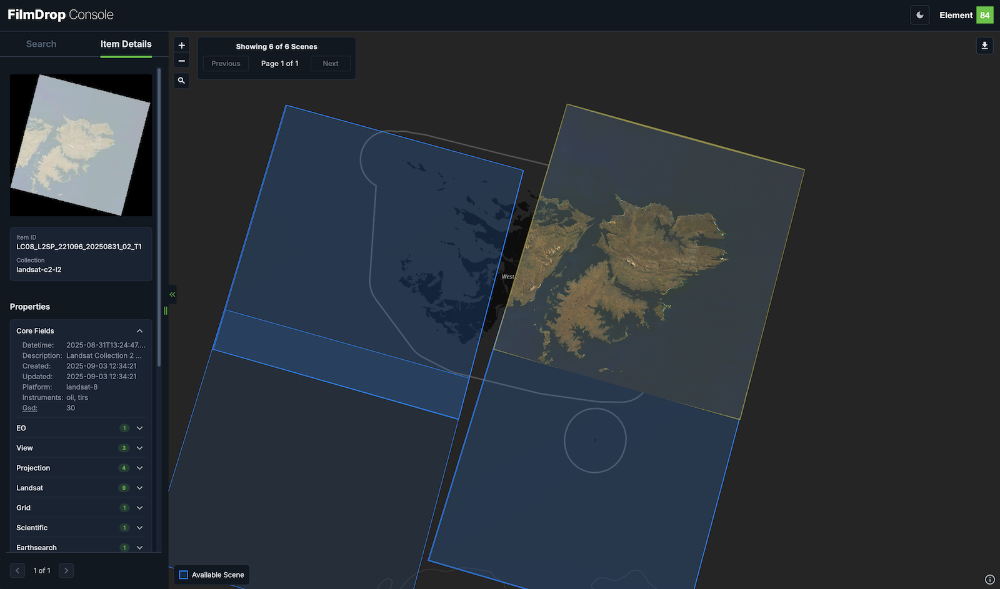
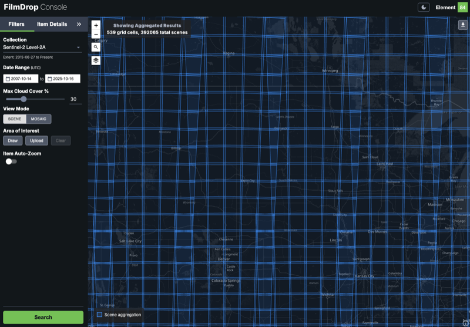

# FilmDrop UI

> A modern, browser-based interface for exploring and visualizing STAC API catalogs

[](LICENSE)

FilmDrop UI is a powerful web application for searching, visualizing, and interacting with
geospatial imagery catalogs through STAC (SpatioTemporal Asset Catalog) APIs. It
provides multiple visualization modes including aggregated views, mosaics, and
individual scenes with advanced filtering and export capabilities.

Check out
[FilmDrop-UI in action with Earth-Search](https://console.earth-search.aws.element84.com/).



## 📋 Table of Contents

- [✨ Key Features](#key-features)
- [🚀 Quick Start](#quick-start)
- [📖 Documentation](#documentation)
- [🎯 Configuration Examples](#configuration-examples)
- [📸 Screenshots](#screenshots)
- [🏗️ Architecture](#architecture)
- [🤝 Contributing](#contributing)
- [📚 Related Projects](#related-projects)
- [📄 License](#license)

## ✨ Key Features

- **🎨 Visualization**
  - Scene View - Individual imagery footprints and tile rendering with TiTiler
  - Mosaic View - Seamless imagery mosaics using TiTiler
  - Hex Aggregation - H3 geohex-based data density visualization
  - Grid Aggregation - Grid code (MGRS, WRS2) based aggregation
  - Customizable color formulas and band combinations

- **🔍 Search**
  - Date/time range filtering
  - Dynamic property filtering (based on collection queryables)
  - Draw or upload GeoJSON search bounds
  - Interactive map with Leaflet
  - Light/dark theme support

- **⚙️ Auto-Configuration**
  - Automatic collection discovery from STAC API with include/exclude filters
  - Automatic rendering configuration using STAC Render Extension (when TiTiler is available)
  - Minimal configuration required - works out-of-the-box with most STAC catalogs
  - Sensible defaults for common parameters

- **🔗 Direct Linking**
  - Share URLs to specific STAC items
  - Browser back/forward navigation
  - Bookmark scenes for later reference

## 🚀 Quick Start

### Prerequisites

- Node.js 18+ and npm
- A STAC API endpoint
- (Optional) TiTiler instance for imagery visualization

```bash
# Clone the repository
git clone https://github.com/Element84/filmdrop-ui.git
cd filmdrop-ui

# Install dependencies
npm install

# Create configuration file
cp config_helper/config-new-format-example.json public/config/config.json

# Edit configuration (at minimum, set STAC_API_URL)
nano public/config/config.json

# Start development server
npm start

# Application available at http://localhost:5173
```

**For production deployment:**

```bash
# Create production build
npm run build

# Build output in ./build directory
# Deploy contents to web server
```

## 📖 Documentation

- **[Configuration Guide](CONFIGURATION.md)** - Complete configuration reference
  with migration guide
- **[Changelog](CHANGELOG.md)** - Version history and changes

### Configuration Quick Reference

Create `public/config/config.json` (development) or `build/config/config.json` (production):

```json
{
  "STAC_API_URL": "https://your-stac-api.com",
  "BASEMAP": {
    "url": "https://tile.openstreetmap.org/{z}/{x}/{y}.png",
    "attribution": "&copy; OpenStreetMap"
  },
  "COLLECTIONS_CONFIG": {
    "your-collection-id": {
      "visualizations": {
        "default": {
          "assets": ["red", "green", "blue"]
        }
      },
      "sceneMinZoom": 7
    }
  }
}
```

### STAC API Requirements

Some FilmDrop features require specific STAC API extensions:

- **Aggregation Views** -
  [Aggregation Extension](https://github.com/stac-api-extensions/aggregation)
  - Hex view requires items with `proj:centroid` property
  - Currently supported by [stac-server](https://github.com/stac-utils/stac-server) and stac-fastapi-elasticsearch-opensearch
  - The aggregation `centroid_geohex_grid_frequency` or `grid_geohex_frequency` (Deprecated) must be advertised by the `/aggregations` endpoint

- **Grid Code Aggregation** - Custom `grid:code` property
  - Items must include grid identifier (e.g., MGRS, WRS2)

- **Dynamic Property Filtering** - Requires a [OGC API Queryables](https://docs.ogc.org/is/19-079r2/19-079r2.html#queryables) endpoint
  - FilmDrop auto-discovers filterable properties from each collection's queryables schema
  - Supported filter types: range sliders (numeric), multi-select (enums), text and numeric inputs
  - Use `queryableFilters` in `COLLECTIONS_CONFIG` to limit which properties appear as filters

- **Automatic Rendering** -
  [Render Extension](https://github.com/stac-extensions/render) (Optional)
  - When `SCENE_TILER_URL` is configured, FilmDrop will automatically configure
    visualization
  - Collections with the `renders` extension will have TiTiler parameters
    auto-configured
  - Eliminates need to manually configure `visualizations.default` for each collection

See [CONFIGURATION.md](CONFIGURATION.md) for detailed feature configuration.

### 📦 Config Format Evolution

FilmDrop UI evolved its configuration format to reduce repetition and improve maintainability. Legacy config keys do not auto-migrated at runtime.
Use the config tooling before startup:

- `npm run config:lint -- public/config/config.json`
- `npm run config:migrate -- --input public/config/config.json --output public/config/config.json.migrated`

See the [Configuration Migration Guide](CONFIGURATION.md#migration-guide) for details.

## 🎯 Configuration Examples

### Basic Setup

Minimal configuration for viewing a single collection:

```json
{
  "STAC_API_URL": "https://earth-search.aws.element84.com/v1",
  "BASEMAP": {
    "url": "https://tile.openstreetmap.org/{z}/{x}/{y}.png",
    "attribution": "&copy; OpenStreetMap"
  },
  "COLLECTIONS_CONFIG": {
    "sentinel-2-l2a": {
      "sceneMinZoom": 7
    }
  }
}
```

### With Imagery Visualization

Add TiTiler for on-the-fly tile generation. Note that `assets` will be auto-configured
based on the collection's STAC metadata if not specified:

```json
{
  "STAC_API_URL": "https://earth-search.aws.element84.com/v1",
  "SCENE_TILER_URL": "https://titiler.xyz",
  "BASEMAP": {
    "url": "https://tile.openstreetmap.org/{z}/{x}/{y}.png",
    "attribution": "&copy; OpenStreetMap"
  },
  "COLLECTIONS_CONFIG": {
    "sentinel-2-l2a": {
      "visualizations": {
        "default": {
          "assets": ["red", "green", "blue"],
          "color_formula": "Gamma+RGB+3.2+Saturation+0.8"
        }
      },
      "sceneMinZoom": 7
    }
  }
}
```

### Multiple Collections

```json
{
  "COLLECTIONS_CONFIG": {
    "sentinel-2-l2a": {
      "visualizations": { "default": { "assets": ["red", "green", "blue"] } },
      "sceneMinZoom": 7
    },
    "landsat-c2-l2": {
      "visualizations": { "default": { "assets": ["red", "green", "blue"] } },
      "sceneMinZoom": 7
    }
  }
}
```

## 📸 Screenshots

### Landsat Hex Aggregation in light mode



### Sentinel-1 Footprints



### Landsat footprints with rendered scene



### Sentinel-2 Grid Aggregation (on MGRS grids)



## 🏗️ Architecture

FilmDrop UI is built with:

- **React** - UI framework
- **Redux** - State management
- **Leaflet** - Interactive mapping
- **Vite** - Build tool and dev server

### Key Design Principles

- **Build-once, deploy-anywhere** - Runtime configuration
- **Responsive design** - Works on desktop and mobile
- **Extensible** - Easy to add new collections and visualizations
- **Performance** - Optimized for large result sets

## 🤝 Contributing

Contributions are welcome! Please feel free to submit a Pull Request.

### Guidelines

- Follow existing code style
- Use meaningful variable and function names
- Add details of the changes/updates to the CHANGELOG's `Unreleased` section
- Add tests for new features
- Update documentation as needed

### Available Scripts

```bash
npm start        # Start development server (localhost:5173)
npm test         # Run test suite
npm run build    # Create production build
npm run coverage # Generate test coverage report
npm run serve    # Serve production build locally
```

### Running Tests

```bash
# Run tests
npm test

# Run tests with coverage
npm run coverage

# Run tests in watch mode
npm test -- --watch
```

## 📚 Related Projects

- [STAC Specification](https://stacspec.org/) - Core STAC specification
- [stac-server](https://github.com/stac-utils/stac-server) - Serverless STAC API
  implementation
- [TiTiler](https://github.com/developmentseed/titiler) - Dynamic tile server
- [NASA IMPACT TiTiler](https://github.com/NASA-IMPACT/titiler) - Extended TiTiler
  with mosaicjson support

## 📄 License

Copyright 2020-2025 Element 84

Licensed under the Apache License, Version 2.0. See [LICENSE](LICENSE) for details.
